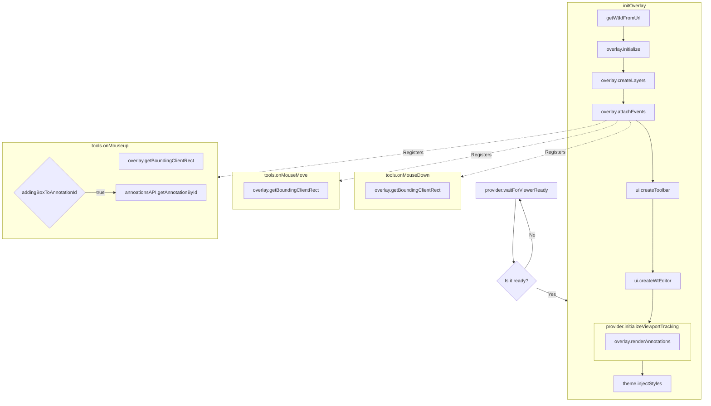

```mermaid
flowchart TB;
    A[provider.waitForViewerReady] --> B{Is it ready?};
    B -- Yes --> C;
    B -- No --> A;
    subgraph C[initOverlay];
        direction TB;
        D[getWtIdFromUrl];
        D --> E[overlay.initialize];
        E --> F[overlay.createLayers];
        F --> G[overlay.attachEvents];
        G --> H[ui.createToolbar];
        H --> I[ui.createWtEditor];
        I --> J
        subgraph J [provider.initializeViewportTracking];
            J1[overlay.renderAnnotations];
        end
        J --> K[theme.injectStyles];
    end

    G -.->|Registers| L1;
    subgraph L1[tools.onMouseDown];
        M[overlay.getBoundingClientRect];
    end
    G -.->|Registers| L2;
    subgraph L2[tools.onMouseMove];
        N[overlay.getBoundingClientRect];
    end
    G -.->|Registers| L3;
    subgraph L3[tools.onMouseup];
        O[overlay.getBoundingClientRect];
        P{addingBoxToAnnotationId}
        P -- true --> Q[annoationsAPI.getAnnotationById];
    end
```
