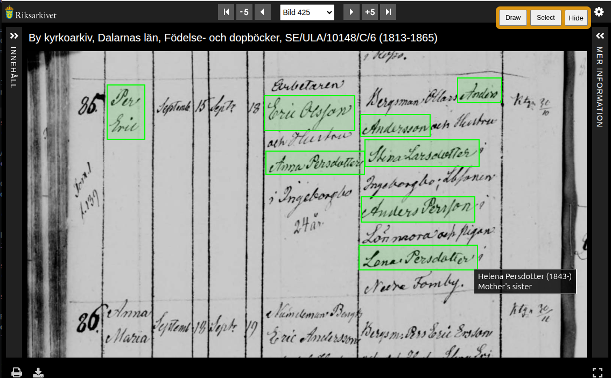

# WikiTree Record Annotator

This Chrome/Chromium browser extension overlays WikiTree-linked annotations directly onto online historical record images. It currently supports records hosted by the Swedish National Archives (Riksarkivet), but is designed to be expandable to other archive sites. Annotations are stored locally using Chrome storage, but the design could be extended to a future shared or collaborative storage model. 

## Features
Annotations appear as shaded boxes over the record image. Their size and position are tied to image coordinates, so they remain correctly positioned during zooming and panning. Hovering the mouse over a box displays information about the linked WikiTree profile, and an optional note (see Lena Persdotter in the screenshot), and clicking on the box will open the profile in a new tab. A toolbar enables the user to draw new annotations, select existing annotations (to edit or delete), and toggle between hiding or showing all annotations. 

A single annotation can have several highlighted boxes, which is useful if a person appears more than once on a record page, or if their name spans two lines. (See Anders Andersson in the screenshot.)

## WikiTree integration
On the WikiTree side, sources in a profile page are marked with an icon  if the source has an annotation which is linked to the profile. Conversely, if an annotation exists in a source which is not cited in the profile, an icon  next to the Sources header will serve as an indicator of that. Clicking the icon will bring up a list of the missing citations in a format that can be copied and pasted into the profile's edit page.  

## Installation
The extension currently requires manual installation and is not yet published in the Chrome Web Store.
1. Clone or download this repository.
2. Open `chrome://extensions`
3. Enable **Developer mode**
4. Click **Load unpacked**
5. Select the extension directory

# Technical details
## Archive provider architecture
Archive-specific functionality is separated into provider modules, allowing support for additional archive systems to be added incrementally.

### Archive runtime API

### WikiTree provider API

## Annotation storage
An annotation record consists of the following fields: 
| Field       | Description                                |
| ----------- | ------------------------------------------ |
| `id`        | Random ID generated at creation            |
| `page`      | Archive page ID                            |
| `source`    | Archive provider ID                        |
| `url`       | Source URL                                 |
| `reference` | Citation/reference text                    |
| `boxes`     | Annotation rectangles in image coordinates |
| `wtId`      | Linked WikiTree ID                         |
| `wtIdFound` | Prefetch success indicator (per session)   |
| `note`      | Optional annotation note                   |

