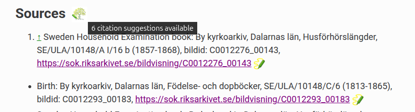

# WikiTree Record Annotator


This Chrome/Chromium browser extension overlays WikiTree-linked annotations directly onto online historical record images. It currently supports records hosted by the [Swedish National Archives (Riksarkivet)](https://sok.riksarkivet.se/) and [Matricula Online](https://data.matricula-online.eu/en/), but is designed to be expandable to other archive sites. Annotations are stored in a shared annotation database hosted on WikiTree+.<br clear="left"/>

## Features
Annotations appear as highlighted frames over the record image. Their size and position are tied to image coordinates, so they remain correctly positioned during zooming and panning. Hovering the mouse over a box displays information about the linked WikiTree profile, and an optional note (see Lena Persdotter in the screenshot), and clicking on the box will open the profile in a new tab. A toolbar enables the user to draw new annotations, select existing annotations (to edit or delete), and toggle between hiding or showing all annotations. 

A single annotation can have several frames, which is useful if a person appears more than once on a record page, or if their name spans two lines. (See Anders Andersson in the screenshot.)


## WikiTree integration
On the WikiTree side, sources in a profile page are marked with an icon  if the source has an annotation which is linked to the profile. Conversely, if an annotation exists in a source which is not cited in the profile, an icon  next to the Sources header will serve as an indicator of that. Clicking the icon will bring up a window with a list of the missing citations in a format that can be copied and pasted into the profile's edit page.  
<table>
<tr>
<td>

</td>
</tr>
</table>

## Installation
The extension currently requires manual installation and is not yet published in the Chrome Web Store.
1. Download the latest release ZIP from the [Releases page](https://github.com/griffithba/wikitree-record-annotator/releases)
2. Extract the ZIP file
3. Open `chrome://extensions` in your browser
4. Enable **Developer mode**
5. Click **Load unpacked**
6. Select the extracted extension folder

## Current limitations
- Currently supports only Riksarkivet and Matricula Online
- Chrome/Chromium-based browsers only
- Mobile (touchscreen) support is experimental

# Technical details
## Archive provider architecture
Archive-specific functionality is encapsulated in provider modules that implement a common interface, allowing the core extension to support multiple archive providers while minimizing provider-specific code.
### Archive provider API
To add a new provider module, the following functions and objects will need to be provided: 
+ function **waitForViewerReady()** - Once the page is loaded, calls initOverlay() and then returns.
+ function **getViewerContainer()** - Returns the element that the annotation overlay should attach to.
+ function **initializeViewportTracking()** - Adds an event listener that will update the stored current viewport and trigger annotation re-rendering after pan/zoom/rotate.
+ function **projectImagePoints(frameData)** - Converts frame data from image coordinates to screen coordinates.
+ function **unprojectScreenPoints(screenFrameData)** - Converts frame data from screen coordinates to image coordinates.
+ function **getCurrentPageKey()** - Returns page identifier for the current page as {site, book, page}.
+ function **getPageKey(href)** - Returns the page identifier for the passed in URL. 
+ function **getReferenceFromPage()** - Returns citation reference text from the page.
+ function **getCleanPageUrl()** - Returns URL with any position/zoom or other data stripped off. 
+ function **buildUrlFromBookPage(book, page)** - Builds a URL that points to the supplied record book and page.  
+ const **site** - Name to differentiate between different archive providers. Needs to match a unique part of the site URL. 

Each provider module needs to add itself to the list of providers like this: 
```
window.archiveProviders ??= [];
window.archiveProviders.push(_provider);
```
New providers will need to be added to `manifest.json`. Copy an existing provider section and replace the URL and provider module file name. (Each archive site must load only one provider module.) The provider module must also be added in the wikitree.com section.  
